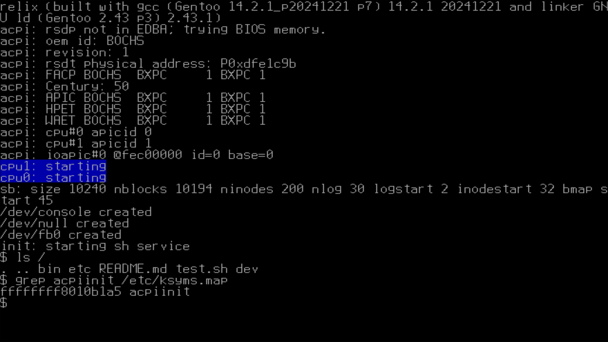

# relix: xv6 work continued from the MIT PDOS team

xv6 is a re-implementation of Dennis Ritchie's and Ken Thompson's Unix
Version 6 (v6). xv6 loosely follows the structure and style of v6,
but is implemented for a modern x86-based multiprocessor using ANSI C.

# Enchancements from the original XV6:
- pixel graphics support with custom fonts
- fixed broken SMP due to a QEMU regression
- added users, groups, and permissions
- organized files into /etc, /bin, and /dev
- ACPI support; falls back to MPS if it fails.
- reboot(1), which can either halt (-h) or poweroff (-p)
- organized file structure support; kernel and userland has a clear separation.
- syscall fuzzing (in the works)
- Rust language support (look in kernel/rust/ and userspace/rust)
- fixed general system ABIs and behaviors to make them align with POSIX.
- doubly indirect block pointer inodes (max filesize 1MiB -> 512MiB)
- ls(1) now has -h, -l, -i, and -p
- 64-bit port, code pulled from swetland/xv6
- multiboot2 support
- SATA R/W support
- pwd.h and /etc/passwd

# dependencies
- gcc/clang
- ld/lld
- objdump, objcopy, ar, ranlib
- rustc, cargo (nightly)
- qemu
- gmake
- grub-mkrescue
- xorriso

# BUILDING AND RUNNING XV6

run ``make qemu`` with a compiler capable of producing ELF files.

On linux-based systems and FreeBSD systems, this means the native compiler.

Note that ``make qemu -j16`` will parallelize the build.

The password for the `root` and `user` accounts are both `x`. This is temporary until hashes are added in /etc/shadow.

# Oh, and it runs DOOM.

# TODO
- XHCI USB keyboard support
